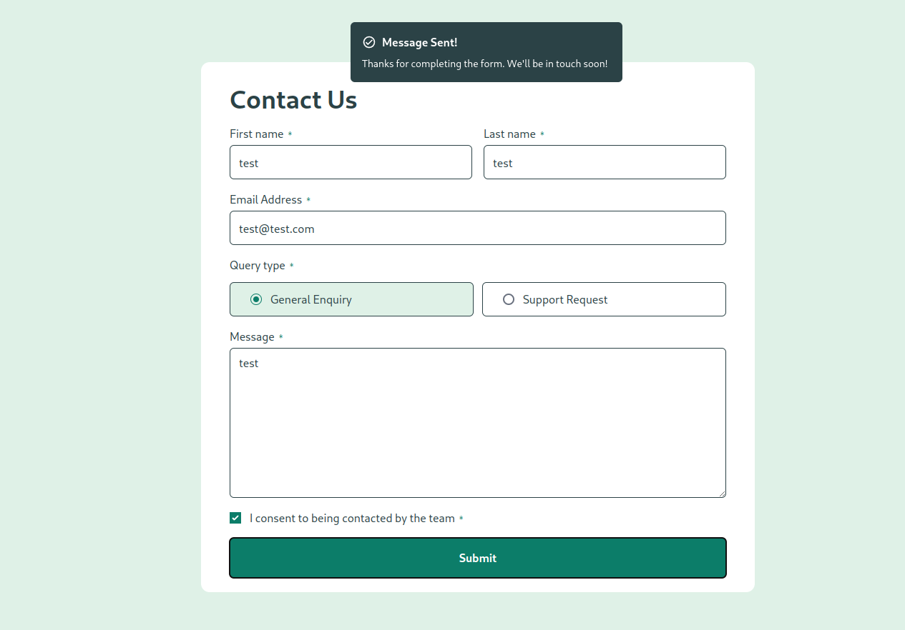
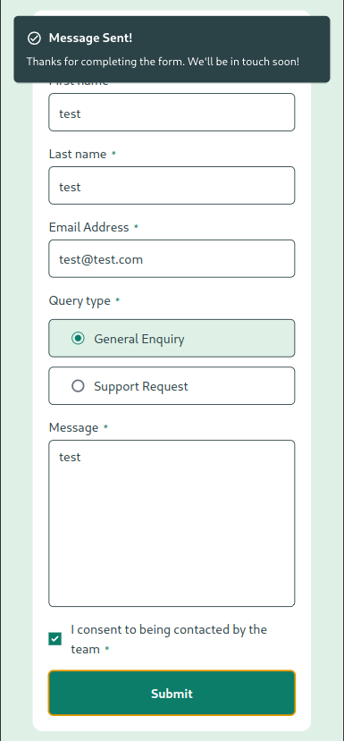

# Frontend Mentor - Contact form solution

This is a solution to the [Contact form challenge on Frontend Mentor](https://www.frontendmentor.io/challenges/contact-form--G-hYlqKJj).

## Table of contents

- [Overview](#overview)
  - [The challenge](#the-challenge)
  - [Screenshot](#screenshot)
  - [Links](#links)
- [My process](#my-process)
  - [Built with](#built-with)
- [Author](#author)

**Note: Delete this note and update the table of contents based on what sections you keep.**

## Overview

### The challenge

Users should be able to:

- Complete the form and see a success toast message upon successful submission
- Receive form validation messages if:
  - A required field has been missed
  - The email address is not formatted correctly
- Complete the form only using their keyboard
- Have inputs, error messages, and the success message announced on their screen reader
- View the optimal layout for the interface depending on their device's screen size
- See hover and focus states for all interactive elements on the page

### Screenshot

  
Contact Form (Desktop view)

  

    
  

  
Contact Form (mobile view)

  

    
  

### Links

- Solution URL: [Contact form](https://g-uriarte.github.io/fm-contact-form/)
- Live Site URL: [Contact form](https://g-uriarte.github.io/fm-contact-form/)

## My process

### Built with

- Semantic HTML5 markup
- Flexbox
- [React](https://reactjs.org/) - JS library
- Typescript
- [Taildwindcss](https://tailwindcss.com/) - For styles

## Author

- Frontend Mentor - [@g-uriarte](https://www.frontendmentor.io/profile/g-uriarte)